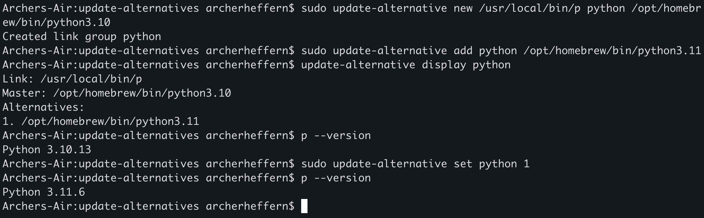
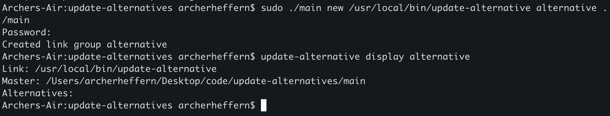

Port of the Debian based alternatives system for macos

* Much easier to use

https://man7.org/linux/man-pages/man1/update-alternatives.1.html

Use cases: 
* Polymorphism of binaries, think strategy pattern. 1 binary is the face of many, you just have to choose which one is 'active'
* Easily adding an executable to your path without having to compress your project into one executable.

Examples: 

1. Polymorphism of binaries

2. Adding executable to path
   My alternatives project lives in ~/Desktop/code/update-alternatives, which is not on my path. However, I can create a link group, that symlinks /usr/local/bin, to ~/Desktop/code/update-alternatives/main. Now I can execute alternatives from anywhere. 

